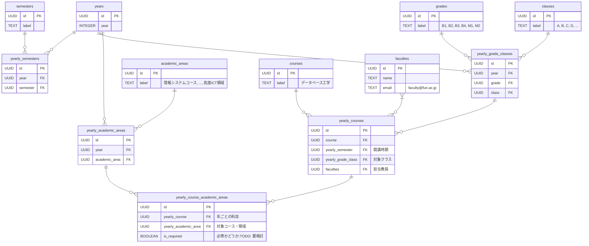

# モデリング

```mermaid
erDiagram
  years ||--o{ yearly_semesters : ""
  semesters ||--o{ yearly_semesters : ""
  years ||--o{ yearly_grade_classes : ""
  grades ||--o{ yearly_grade_classes : ""
  classes ||--o{ yearly_grade_classes : ""
  years ||--o{ yearly_academic_areas : ""
  academic_areas ||--o{ yearly_academic_areas : ""
  courses ||--o{ yearly_courses : ""
  yearly_grade_classes ||--o{ yearly_courses : ""
  faculties }|--o{ yearly_courses : ""
  yearly_courses ||--o{ yearly_course_academic_areas : ""
  yearly_academic_areas ||--o{ yearly_course_academic_areas : ""

  years {
    UUID id PK
    INTEGER year
  }
  semesters {
    UUID id PK
    TEXT label
  }
  yearly_semesters {
    UUID id PK
    UUID year FK
    UUID semester FK
  }
  grades {
    UUID id PK
    TEXT label "B1, B2, B3, B4, M1, M2"
  }
  classes {
    UUID id PK
    TEXT label "A, B, C, D, ..."
  }
  yearly_grade_classes {
    UUID id PK
    UUID year FK
    UUID grade FK
    UUID class FK
  }
  academic_areas {
    UUID id PK
    TEXT label "情報システムコース, ..., 高度ICT領域"
  }
  yearly_academic_areas {
    UUID id PK
    UUID year FK
    UUID academic_area FK
  }
  faculties {
    UUID id PK
    TEXT name
    TEXT email "faculty@fun.ac.jp"
  }
  courses {
    UUID id PK
    TEXT label "データベース工学"
  }
  yearly_courses {
    UUID id PK
    UUID course FK
    UUID yearly_semester FK "開講時期"
    UUID yearly_grade_class FK "対象クラス"
    UUID faculties FK "担当教員"
  }
  yearly_course_academic_areas {
    UUID id PK
    UUID yearly_course FK "年ごとの科目"
    UUID yearly_academic_area FK "対象コース・領域"
    BOOLEAN is_required "必修かどうか;TODO: 要検討"
  }
```
