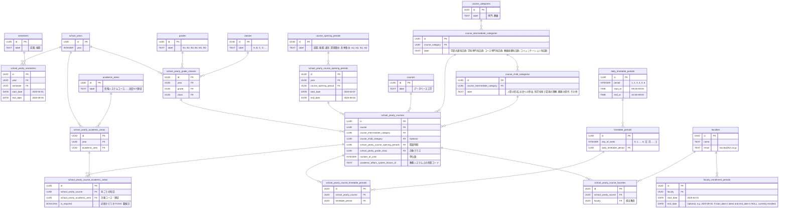

# モデリング

```mermaid
erDiagram
  school_years {
    UUID id PK
    INTEGER year
  }
  school_years ||--o{ school_yearly_semesters : ""
  school_years ||--o{ school_yearly_grade_classes : ""
  school_years ||--o{ school_yearly_academic_areas : ""

  school_yearly_semesters {
    UUID id PK
    UUID year FK
    UUID semester FK
    DATE start_date "2025-04-01"
    DATE end_date "2025-09-30"
  }

  school_yearly_grade_classes {
    UUID id PK
    UUID year FK
    UUID grade FK
    UUID class FK
  }
  school_yearly_grade_classes ||--o{ school_yearly_courses : ""

  school_yearly_courses {
    UUID id PK
    UUID course FK
    UUID course_intermediate_category FK
    UUID course_child_category FK "Optional"
    UUID school_yearly_course_opening_periods FK "開講時期"
    UUID school_yearly_grade_class FK "対象クラス"
    INTEGER number_of_units "単位数"
    TEXT academic_affairs_system_lesson_id "教務システム上の授業コード"
  }
  school_yearly_courses ||--o{ school_yearly_course_academic_areas : ""
  school_yearly_courses ||--o{ school_yearly_course_timetable_periods : ""
  school_yearly_courses ||--o{ school_yearly_course_faculties : ""

  school_yearly_course_faculties {
    UUID id PK
    UUID school_yearly_course FK
    UUID faculty FK "担当教員"
  }

  school_yearly_course_timetable_periods {
    UUID id PK
    UUID school_yearly_course FK
    UUID timetable_period FK
  }

  school_yearly_course_academic_areas {
    UUID id PK
    UUID school_yearly_course FK "年ごとの科目"
    UUID school_yearly_academic_area FK "対象コース・領域"
    BOOLEAN is_required "必修かどうか;TODO: 要検討"
  }

  semesters {
    UUID id PK
    TEXT label "前期, 後期"
  }
  semesters ||--o{ school_yearly_semesters : ""

  course_opening_periods {
    UUID id PK
    TEXT label "前期, 後期, 通年, 夏期集中, 冬季集中, 1Q, 2Q, 3Q, 4Q"
  }
  course_opening_periods ||--o{ school_yearly_course_opening_periods : ""

  school_yearly_course_opening_periods {
    UUID id PK
    UUID year FK
    UUID course_opening_period FK
    DATE start_date "2025-04-07"
    DATE end_date "2025-08-04"
  }
  school_yearly_course_opening_periods ||--o{ school_yearly_courses : ""

  grades {
    UUID id PK
    TEXT label "B1, B2, B3, B4, M1, M2"
  }
  grades ||--o{ school_yearly_grade_classes : ""

  classes {
    UUID id PK
    TEXT label "A, B, C, D, ..."
  }
  classes ||--o{ school_yearly_grade_classes : ""

  academic_areas {
    UUID id PK
    TEXT label "情報システムコース, ..., 高度ICT領域"
  }
  academic_areas ||--o{ school_yearly_academic_areas : ""

  school_yearly_academic_areas {
    UUID id PK
    UUID year FK
    UUID academic_area FK
  }
  school_yearly_academic_areas ||--o{ school_yearly_course_academic_areas : ""

  faculties {
    UUID id PK
    TEXT name
    TEXT email "faculty@fun.ac.jp"
  }
  faculties ||--o{ school_yearly_course_faculties : ""
  faculties ||--o{ faculty_enrollment_periods : ""

  courses {
    UUID id PK
    TEXT label "データベース工学"
  }
  courses ||--o{ school_yearly_courses : ""

  course_categories {
    UUID id PK
    TEXT label "専門, 教養"
  }
  course_categories ||--o{ course_intermediate_categories : ""

  course_intermediate_categories {
    UUID id PK
    UUID course_category FK
    TEXT label "学部共通科目群, 学科専門科目群, コース専門科目群, 教養基礎科目群, コミュニケーション科目群"
  }
  course_intermediate_categories ||--o{ course_child_categories : ""
  course_intermediate_categories ||--o{ school_yearly_courses : ""

  course_child_categories {
    UUID id PK
    UUID course_intermediate_category FK
    TEXT label "人間の形成, 社会への参加, 科学技術と環境の理解, 健康の保持, その他"
  }
  course_child_categories ||--o{ school_yearly_courses : ""

  timetable_periods {
    UUID id PK
    INTEGER day_of_week "0, 1, ..., 6; 日, 月, ..., 土"
    UUID daily_timetable_period FK
  }
  timetable_periods ||--o{ school_yearly_course_timetable_periods : ""

  daily_timetable_periods {
    UUID id PK
    INTEGER period "1, 2, 3, 4, 5, 6"
    TIME start_at "09:00+09:00"
    TIME end_at "10:30+09:00"
  }
  daily_timetable_periods ||--o{ timetable_periods : ""

  faculty_enrollment_periods {
    UUID id PK
    UUID faculty FK
    DATE start_date "2025-04-01"
    DATE end_date "Optional, e.g. 2025-09-30. If start_date is latest and end_date is NULL, currently enrolled."
  }
```
